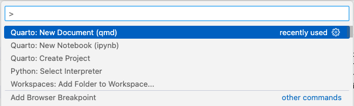
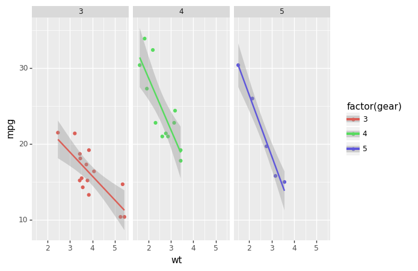
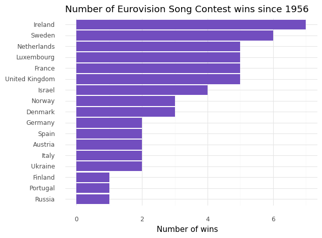

Analyzing the Eurovision with Snowpark
================

Python is the language of choice for many Data Scientists. It has a rich
set of packages for different Data Science tasks. Therefore, many Data
Scientists were excited when Snowflake announced integrations with
Python in their database.

To faciliate integrations to other programming languages Snowflake has
created Snowpark. With Snowpark you can create user defined functions
and stored procedures to run Python scripts that, for example, train a
Machine Learning model and writes the result to the database, without
having to move the data out of the database. There are tons of tutorials
on how to do this. Today I’d like to focus on another aspect of what we
as Data Scientists do. As a Data Scientist I do not spend most of my
time building ML-models. Most of my work is centered around doing
exploratory analysis, digging into unseen data, making visualizations
and sharing these with stakeholders.

In this blogpost I’d like to share with you how we can use the Snowpark
DataFrame API together with Quarto to create a dynamic presentation that
analyzes the Eurovision song contest, without having to open Microsoft
Powerpoint or Google Slides.

## On notebooks

Many Data Scientists uses Jupyter Notebook to do data analysis. In a
Jupter Notebook you can combine code with plots and text to comment your
findings. However, when you want to bring a notebook into the hands of a
stakeholder, you rarely want to send a raw notebook. In my case I
usually want to put together a report or a presentation. There are ways
to do this with Jupyter, but it always feels a bit clumsy.

## Enter Quarto

Quarto is an open-source scientific and technical publishing system
built on Pandoc. It is very similar to a Jupyter Notebook (and is
actually powered by Jupyter) but the output is, in my view, prettier.
Because it is based on Pandoc you can render your code into a report, a
presentation or even a website. If you are familiar to Rmarkdown Quarto
basically works in the same way but is language agnostic.

## Development setup for Quarto

For my Python work I mainly use VSCode. One good thing about Quarto is
that it has an excellent VSCode plugin. You can follow the instructions
[here](https://quarto.org/docs/get-started/hello/vscode.html).


## Creating a virtual environment for Snowpark

I use `conda` to create virtual environments for Python. In this case I
have a `conda.yml` where I list package dependencies. The yaml-file
comes from a [Snowflake
tutorial](https://github.com/Snowflake-Labs/sfguide-getting-started-machine-learning.git).

``` python
conda env create -f conda_env.yml
conda activate pysnowpark
```

To be able to use the environment in Quarto I need to register it to the
jupyter kernel.

``` python
python -m ipykernel install --user --name=pysnowpark
```

## Set up the Quarto document

Via the command palette in VSCode you can easily create a new `.qmd`
document (or .ipynb if you want the Jupyter notebook experience)


I’m using `.qmd`. In the header I can now specify my virtual
environment.

    ---
    title: "Reporting with Python and Snowflake in Quarto"
    format: html
    jupyter: pysnowpark
    ---

Now you can just add python code chunks to your document. I will be
using `plotnine` to create plots in our report.

``` python
from plotnine import ggplot, geom_point, aes, stat_smooth, facet_wrap
from plotnine.data import mtcars

(ggplot(mtcars, aes('wt', 'mpg', color='factor(gear)'))
 + geom_point()
 + stat_smooth(method='lm')
 + facet_wrap('~gear'))
```



    <ggplot: (8766900949303)>

## Connect to Snowflake

I have created a free [30 day trial for
Snowflake](https://signup.snowflake.com/). To be able to use Snowpark in
Snowflake there are some more configurations you have to set up. You can
find those
[here](https://quickstarts.snowflake.com/guide/getting_started_snowpark_machine_learning/index.html#0).

``` python
from snowflake.snowpark.session import Session
from keyring import get_password
import pandas as pd

service_id = 'snowflake-trial'

connection_parameters = {
    "account": get_password(service_id, 'accountname'),
    "user": get_password(service_id, 'username'),
    "password": get_password(service_id, 'password'),
    "role": "ACCOUNTADMIN",
    "database": "HOL_DB",
    "schema": "PUBLIC",
    "warehouse": "HOL_WH"
}

session = Session.builder.configs(connection_parameters).create()
```

## Load some data to Snowflake

For our report we have some data on the [Eurovision Song
Contest](https://github.com/Spijkervet/eurovision-dataset).

We can write this data to Snowflake with Snowpark.

``` python
contestants_df = pd.read_csv('data/contestants.csv')
votes_df = pd.read_csv('data/votes.csv')

contestants_df.columns = map(str.upper, contestants_df.columns)
votes_df.columns = map(str.upper, votes_df.columns) # To make our dataset work with the Snowpark API we need to make the columns names upper case.

session.write_pandas(contestants_df, table_name = 'CONTESTANTS', auto_create_table = True, overwrite = True)
session.write_pandas(votes_df, table_name = 'VOTES', auto_create_table = True, overwrite = True)
```

## Using Snowpark DataFrame API and visualizing

Next, we can create a snowpark dataframe from the database table.

``` python
contestant_sdf = session.table('contestants')
```

This dataframe we can query using the Snowpark DataFrame API. It is like
a combination between Pandas and SQL. To display the result or use it
for anything else in a Python environment you can use `to_pandas()`.

``` python
contestant_sdf.limit(6).to_pandas()
```

<div>
<style scoped>
    .dataframe tbody tr th:only-of-type {
        vertical-align: middle;
    }

    .dataframe tbody tr th {
        vertical-align: top;
    }

    .dataframe thead th {
        text-align: right;
    }
</style>
<table border="1" class="dataframe">
  <thead>
    <tr style="text-align: right;">
      <th></th>
      <th>YEAR</th>
      <th>TO_COUNTRY_ID</th>
      <th>TO_COUNTRY</th>
      <th>PERFORMER</th>
      <th>SONG</th>
      <th>PLACE_CONTEST</th>
      <th>SF_NUM</th>
      <th>RUNNING_FINAL</th>
      <th>RUNNING_SF</th>
      <th>PLACE_FINAL</th>
      <th>...</th>
      <th>PLACE_SF</th>
      <th>POINTS_SF</th>
      <th>POINTS_TELE_FINAL</th>
      <th>POINTS_JURY_FINAL</th>
      <th>POINTS_TELE_SF</th>
      <th>POINTS_JURY_SF</th>
      <th>COMPOSERS</th>
      <th>LYRICISTS</th>
      <th>LYRICS</th>
      <th>YOUTUBE_URL</th>
    </tr>
  </thead>
  <tbody>
    <tr>
      <th>0</th>
      <td>1956</td>
      <td>ch</td>
      <td>Switzerland</td>
      <td>Lys Assia</td>
      <td>Refrain</td>
      <td>2.0</td>
      <td>NaN</td>
      <td>2.0</td>
      <td>NaN</td>
      <td>2.0</td>
      <td>...</td>
      <td>NaN</td>
      <td>NaN</td>
      <td>NaN</td>
      <td>NaN</td>
      <td>NaN</td>
      <td>NaN</td>
      <td>Georg Benz Stahl</td>
      <td>None</td>
      <td>(Refrain d'amour...)\n\nRefrain, couleur du ci...</td>
      <td>https://youtube.com/watch?v=IyqIPvOkiRk</td>
    </tr>
    <tr>
      <th>1</th>
      <td>1956</td>
      <td>nl</td>
      <td>Netherlands</td>
      <td>Jetty Paerl</td>
      <td>De Vogels Van Holland</td>
      <td>2.0</td>
      <td>NaN</td>
      <td>1.0</td>
      <td>NaN</td>
      <td>2.0</td>
      <td>...</td>
      <td>NaN</td>
      <td>NaN</td>
      <td>NaN</td>
      <td>NaN</td>
      <td>NaN</td>
      <td>NaN</td>
      <td>Cor Lemaire</td>
      <td>Annie M. G. Schmidt</td>
      <td>De vogels van Holland zijn zo muzikaal\nZe ler...</td>
      <td>https://youtube.com/watch?v=u45UQVGRVPA</td>
    </tr>
    <tr>
      <th>2</th>
      <td>1956</td>
      <td>be</td>
      <td>Belgium</td>
      <td>Fud Leclerc</td>
      <td>Messieurs Les Noyés De La Seine</td>
      <td>2.0</td>
      <td>NaN</td>
      <td>3.0</td>
      <td>NaN</td>
      <td>2.0</td>
      <td>...</td>
      <td>NaN</td>
      <td>NaN</td>
      <td>NaN</td>
      <td>NaN</td>
      <td>NaN</td>
      <td>NaN</td>
      <td>Jacques Say;Jean Miret</td>
      <td>Robert Montal</td>
      <td>Messieurs les noyés de la Seine\nOuvrez-moi le...</td>
      <td>https://youtube.com/watch?v=U9O3sqlyra0</td>
    </tr>
    <tr>
      <th>3</th>
      <td>1956</td>
      <td>de</td>
      <td>Germany</td>
      <td>Walter Andreas Schwarz</td>
      <td>Im Wartesaal Zum Großen Glück</td>
      <td>2.0</td>
      <td>NaN</td>
      <td>4.0</td>
      <td>NaN</td>
      <td>2.0</td>
      <td>...</td>
      <td>NaN</td>
      <td>NaN</td>
      <td>NaN</td>
      <td>NaN</td>
      <td>NaN</td>
      <td>NaN</td>
      <td>Walter Andreas Schwarz</td>
      <td>None</td>
      <td>Es gibt einen Hafen, da fährt kaum ein Schiff\...</td>
      <td>https://youtube.com/watch?v=BDNARIDnmTc</td>
    </tr>
    <tr>
      <th>4</th>
      <td>1956</td>
      <td>fr</td>
      <td>France</td>
      <td>Mathé Altéry</td>
      <td>Le Temps Perdu</td>
      <td>2.0</td>
      <td>NaN</td>
      <td>5.0</td>
      <td>NaN</td>
      <td>2.0</td>
      <td>...</td>
      <td>NaN</td>
      <td>NaN</td>
      <td>NaN</td>
      <td>NaN</td>
      <td>NaN</td>
      <td>NaN</td>
      <td>André Lodge</td>
      <td>Rachèle Thoreau</td>
      <td>Chante, carillon\nLe chant du temps perdu\nCha...</td>
      <td>https://youtube.com/watch?v=dm1L0XyikKI</td>
    </tr>
    <tr>
      <th>5</th>
      <td>1956</td>
      <td>lu</td>
      <td>Luxembourg</td>
      <td>Michèle Arnaud</td>
      <td>Ne Crois Pas</td>
      <td>2.0</td>
      <td>NaN</td>
      <td>13.0</td>
      <td>NaN</td>
      <td>2.0</td>
      <td>...</td>
      <td>NaN</td>
      <td>NaN</td>
      <td>NaN</td>
      <td>NaN</td>
      <td>NaN</td>
      <td>NaN</td>
      <td>Christian Guitreau</td>
      <td>None</td>
      <td>Si on te dit qu't'a une belle gueule\nY a pas ...</td>
      <td>https://youtube.com/watch?v=Pv7GJkqtNuc</td>
    </tr>
  </tbody>
</table>
<p>6 rows × 21 columns</p>
</div>

Okey, so let’s build a simple plot that shows the number of wins per
country in descending order. First, we can use Snowpark to compute the
number of wins per country. By doing this we are writing Python code but
the actual data aggregation is executed within Snowflake.

``` python
winners = (contestant_sdf
                .filter("place_final = 1")
                .group_by('to_country')
                .count()
                .to_pandas()
                .sort_values(by = 'COUNT', ascending = False)
                .head(17)
)
```

Next we visualize it.

``` python
from plotnine import labs, geom_col, geom_line, coord_flip, scale_x_discrete, theme_minimal

(ggplot(winners, aes(y = 'COUNT', x = 'TO_COUNTRY'))
 + geom_col(fill = '#724EBF')
 + coord_flip()
 + scale_x_discrete(limits=winners['TO_COUNTRY'][::-1])
 + labs(title = "Number of Eurovision Song Contest wins since 1956",
 y = "Number of wins",
 x = "")
 + theme_minimal())
```



    <ggplot: (8766908023327)>

## Making a Quarto report

Okay, so now we know how run Python on Snowflake tables, make some
pretty visualizations. Only thing left is making this into a report to
share with stakeholders.

Once we have the database and the virtual environment ready putting
together a Quarto report is really is easy. In Quarto we can use
parameters in the code chunks to “echo” the code or hide it by setting
`#|echo: false` in a code chunk. Usually the code is not that
interesting to look at if you don’t know Python.

For this report I have changed the plotting library to Plotly for
interactive plots.

This is how the report looks.


But if we want to make it into a presentation that is as easy as
changing the format:

    ---
    title: "My Eurovision Slideshow"
    jupyter: pysnowpark
    format:
      revealjs: 
        theme: moon
    ---


You can take a look at the code for this report here.

## Why do this?

Making beautiful reporting in Python has not been all that easy in the
past. With Quarto we can create informative reports, slideshows and
websites that gets our Python results closer to stakeholders. And all of
this can be done without traditional reporting tools like Powerpoint or
Google Slides, making our work more reproducible and less prone to
error.

What a like about the Snowpark DataFrame API is that it brings data
closer to the Data Scientist. I have seen many analysts and Data
Scientists working primarily in the Snowflake online editor, download
result of their queries and then visualize it. With Snowpark Data
Scientists don’t have to switch between development environments.

This has the potential for making reporting a lot easier for Data
Scientist.
